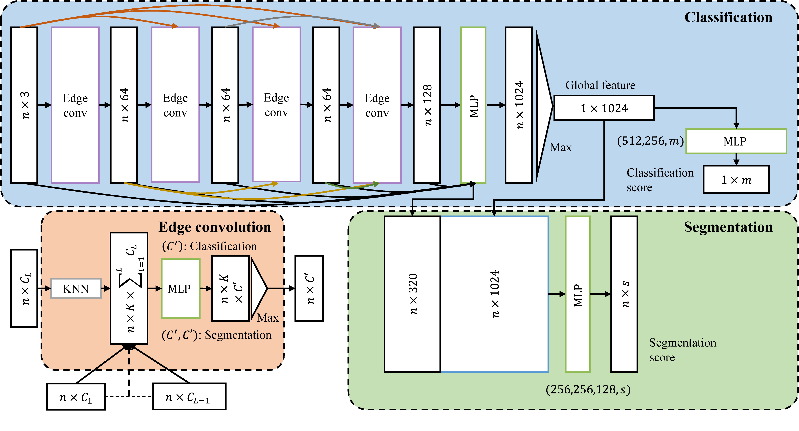

# Linked Dynamic Graph CNN: Learning on Point Cloud via Linking Hierarchical Features



We propose a linked dynamic graph CNN (LDGCNN) to classify and segment point cloud directly. We remove the transformation network, link hierarchical features from dynamic graphs, freeze feature extractor, and retrain the classifier to increase the performance of LDGCNN.

## Citation
If you find our work useful in your research, please consider citing:

K. Zhang, M. Hao, J. Wang, C. W. de Silva, and C. Fu, “Linked dynamic graph cnn: learning on point cloud via linking hierarchical features,” arXiv:1904.10014 [cs], Apr. 2019.

## Overview
`LDGCNN` is the improved version of Dynamic Graph CNN. We have evaluated our network on the point cloud classification dataset (ModelNet40) and segementation dataset (ShapeNet):

* Classification accuracy on the ModelNet40: **92.9%**.
* Mean IoU on the ShapeNet: **85.0%**

Further information please contact Kuangen Zhang (kuangen.zhang@alumni.ubc.ca).

## Requirements
* [TensorFlow](https://www.tensorflow.org/)
* h5py
```bash
sudo apt-get install libhdf5-dev
sudo pip install h5py
```

## Point cloud classification
### Dataset 

* ModelNet40 dataset is downloaded automatically through the `provider.py`.


* We upload our pretrained model, you can evaluate the performance of our network directly by running the evaluation script:
``` bash
python evalutate.py
```
* Run the training script:
``` bash
python train.py
```

## Point cloud segmentation

Enter the "part_seg" file folder.

### Dataset 
Load the data for part segmentation.
```
sh +x download_data.sh
```

### Evaluation
We upload our trained model. You can evaluate the trained model by running: 
```
python test.py
```

### Train
Train the model on 2 GPUs, each with 12 GB memeory. 
```
python train_multi_gpu.py
```
Model parameters with the highest validation accuracy are saved in "log/ldgcnn_seg.ckpt*".

## License
MIT License

## Acknowledgement
We achknowledeg that we borrow the code from [PointNet](https://github.com/charlesq34/pointnet) and [DGCNN](https://github.com/WangYueFt/dgcnn) heavily. We have marked our own parts in the code, otherwise the code is borrowed from PointNet and DGCNN.

## Reference
* C.  R.  Qi,  H.  Su,  K.  Mo,  and  L.  J.  Guibas,  “PointNet:Deep  Learning  on  Point  Sets  for  3d  Classification  andSegmentation,”  in2017  IEEE  Conference  on  ComputerVision  and  Pattern  Recognition  (CVPR),  Jul.  2017,  pp.77–85, read.
* Y. Wang, Y. Sun, Z. Liu, S. E. Sarma, M. M. Bronstein,and J. M. Solomon, “Dynamic Graph CNN for Learningon  Point  Clouds,”arXiv:1801.07829  [cs],  Jan.  2018,arXiv: 1801.07829.
